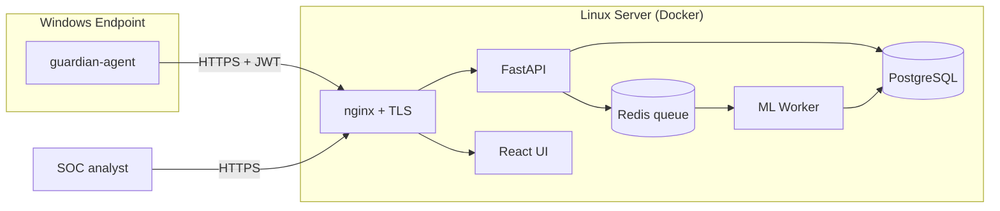

# GuardIAn — Detection & Response Platform

> **Hackathon Togo IT Days 2025 — EPL Team — v2 Refonte**

GuardIAn is an open-source **EDR-style** (Endpoint Detection & Response) platform focused on **ransomware** and other commodity malware. It is composed of three independent components designed to scale from a single workstation to a small SOC:

| Component | Role | Tech |
| --- | --- | --- |
| **Agent** | Runs on each protected Windows endpoint. Watches files, processes and registry. Computes lightweight heuristics (entropy, signatures, YARA) and forwards events to the backend. | Python 3.12 + watchdog + psutil + (optional) PyInstaller |
| **Backend** | Central API. Receives events, runs the unified ML detector + rule engine (YARA/Sigma), persists threats, exposes REST + WebSocket. | FastAPI + SQLAlchemy + PostgreSQL + Redis (RQ) + scikit-learn |
| **Frontend** | SOC analyst dashboard: live status, threats, scans, eradication plans, intel. | React 18 + Vite + TypeScript + Tailwind + Recharts |



---

##  Quick start (development, Linux/macOS/Windows + Docker Desktop)

```bash
git clone https://github.com/Patrickleondev/Hackathon_au_Togo_IT_Days_2025_EPL_Team.git
cd Hackathon_au_Togo_IT_Days_2025_EPL_Team
cp infra/.env.example infra/.env
# Edit infra/.env and set SECRET_KEY, BOOTSTRAP_ADMIN_PASSWORD, POSTGRES_PASSWORD
docker compose -f infra/docker-compose.yml up --build
```

Then open:

- Public site (landing + démos vidéo) : <http://localhost:5173>
- Console SOC (login required): <http://localhost:5173/login> → <http://localhost:5173/app>
- Backend API docs: <http://localhost:8000/docs>
- API health: <http://localhost:8000/api/health>

Default analyst credentials come from `BOOTSTRAP_ADMIN_EMAIL` / `BOOTSTRAP_ADMIN_PASSWORD` in `infra/.env`.

For full prerequisites, local/VPS choices, troubleshooting and production
hardening, start with [docs/PREREQUISITES.md](docs/PREREQUISITES.md),
[docs/04-INSTALL.md](docs/04-INSTALL.md) and
[docs/08-DEPLOYMENT.md](docs/08-DEPLOYMENT.md).

---

##  Documentation

All detailed docs live under [`docs/`](docs/):

| File | Topic |
| --- | --- |
| [01-VISION.md](docs/01-VISION.md) | Problem statement, threat model, scope, non-goals |
| [02-ARCHITECTURE.md](docs/02-ARCHITECTURE.md) | Components, data flow, network topology, sequence diagrams |
| [03-ALGORITHMS.md](docs/03-ALGORITHMS.md) | Detector internals (features, scoring, rule engine, eradication) |
| [04-INSTALL.md](docs/04-INSTALL.md) | Local install, development modes, Docker Compose, troubleshooting |
| [05-AGENT-WINDOWS.md](docs/05-AGENT-WINDOWS.md) | Building, deploying and operating the Windows agent |
| [06-API.md](docs/06-API.md) | REST + WebSocket reference (companion to /docs OpenAPI) |
| [07-OPS.md](docs/07-OPS.md) | Logs, metrics, backups, rule updates, troubleshooting |
| [08-DEPLOYMENT.md](docs/08-DEPLOYMENT.md) | VPS/on-prem production, TLS, secrets, hardening, backups |
| [09-CONTRIBUTING.md](docs/09-CONTRIBUTING.md) | Branching, code style, tests, release process |

---

##  Repository layout

```text
.
├── agent/          # Windows endpoint agent (Python)
├── backend/        # FastAPI server + ML worker
├── frontend/       # Vite + React SOC dashboard
├── infra/          # docker-compose, nginx, env templates
├── docs/           # All architecture / install / ops docs
├── scripts/        # Training, samples, utilities
├── legacy/         # Original Hackathon 2025 codebase (frozen, not built)
├── LICENSE
└── README.md
```

The directory `legacy/` keeps the original hackathon code as a historical
reference. **It is not built, not deployed, and not exposed.**

---

##  Security posture

- **Local-only by default** — no telemetry leaves the operator's network.
- **mTLS-ready** between agent and backend (see `docs/08-DEPLOYMENT.md`).
- **No payload** ever runs server-side — analysis is performed on hashes,
  metadata, and sandboxed feature extraction only.
- **Deny-by-default** quarantine: dry-run is always the default for
  eradication plans (`POST /api/eradications` requires `dry_run=false`
  explicitly to take action).

---

##  License

MIT — see [LICENSE](LICENSE).

---

## 🇹🇬 Credits

Originally built during the **Togo IT Days 2025 hackathon** by the EPL Team.
v2 refonte focuses on producing a coherent, deployable, documented,
production-grade reference implementation.

CERT-TG hotline (incident response in Togo): **(+228) 70 54 93 25**
