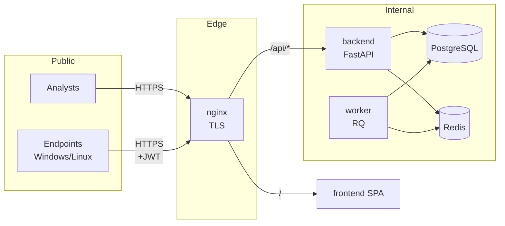
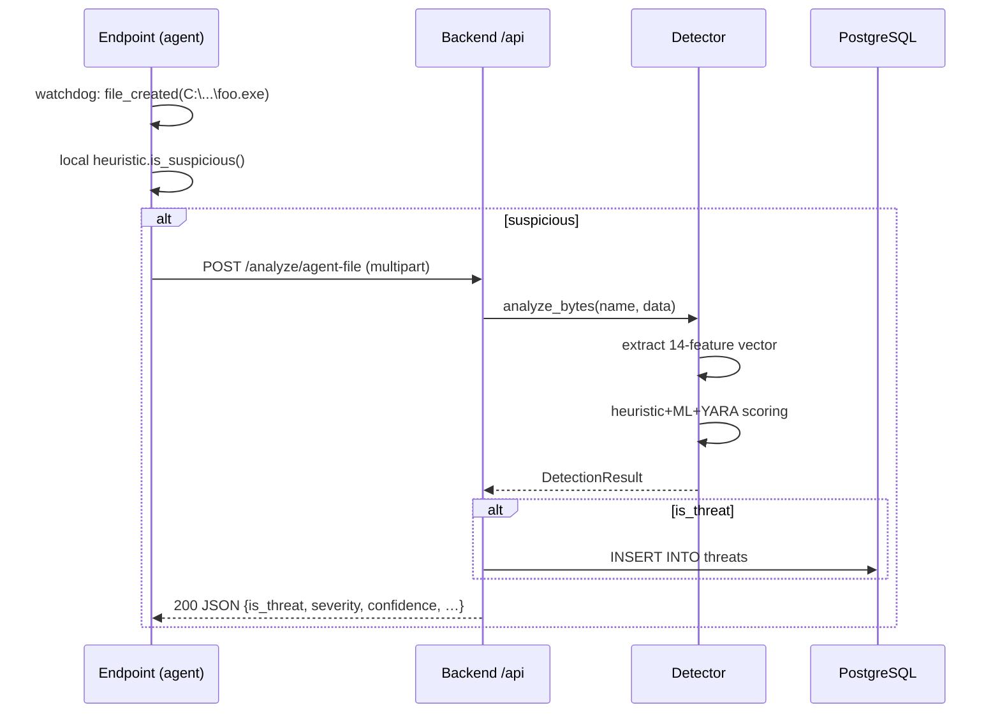

# 02 — Architecture

## Components

| Service | Tech | Role | Network |
|---------|------|------|---------|
| `backend` | FastAPI 0.115, Python 3.12 | REST API, detector orchestration | internal |
| `worker` | RQ (Redis Queue) | Async file analysis & scans | internal |
| `db` | PostgreSQL 16 | Threats, agents, scans, eradications | internal |
| `redis` | Redis 7 | Job queue, rate-limit, cache | internal |
| `frontend` | React + Vite + TS | Analyst console SPA | edge |
| `nginx` | nginx 1.27 | TLS termination, reverse proxy | edge |
| `agent` | Python 3.12 + watchdog | Endpoint sensor (Windows / Linux) | client-side |

## Topology (production)



## Data model (simplified)

```
User(id, email, password_hash, role) ─┐
Agent(id, hostname, os, token)        ├── audit ───► created_at / updated_at
Threat(id, agent_id?, type, severity, │   on every row
       confidence, file_sha256,       │
       indicators JSON, status)       │
Scan(id, scan_type, status,           │
     target_paths, files_scanned,     │
     threats_found)                   │
Eradication(id, threat_id, actions,   │
            scope JSON, dry_run,      │
            result JSON)              ┘
```

## Detection sequence



## Authentication

Two distinct JWT scopes signed with the same `SECRET_KEY` but different TTLs:

- **`scope=user`** — analysts logging into the SPA. 60-minute access token.
- **`scope=agent`** — endpoint sensors. 30-day access token, issued at enrollment.

Routes use FastAPI dependencies (`require_user`, `require_agent`) to enforce
scope. There is no shared route — analysts cannot impersonate agents and
vice-versa.

## Storage layout (inside the backend container)

```
/var/lib/guardian/
├── uploads/        # incoming files for analyze/file
├── quarantine/     # quarantined samples (server-side eradication)
├── models/         # detector.joblib (scikit-learn bundle)
└── rules/          # *.yar / *.yara YARA rules
```

These are mounted as the `rg_data` Docker volume, so they survive
backend image updates.

## Failure modes

| Failure | Behaviour |
|---------|-----------|
| ML model missing | Detector falls back to heuristic+YARA only (`detector_ready=false`) |
| YARA lib unavailable | YARA score skipped; weights reweighted to heuristic+ML |
| DB down | API returns 503 on routes that need it; agents queue uploads with retry |
| Redis down | Workers stop; sync API endpoints still work |
