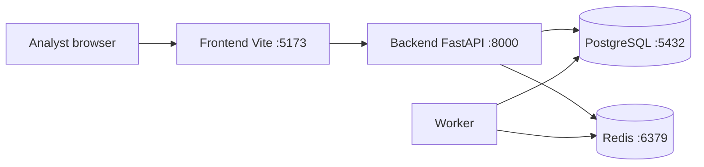
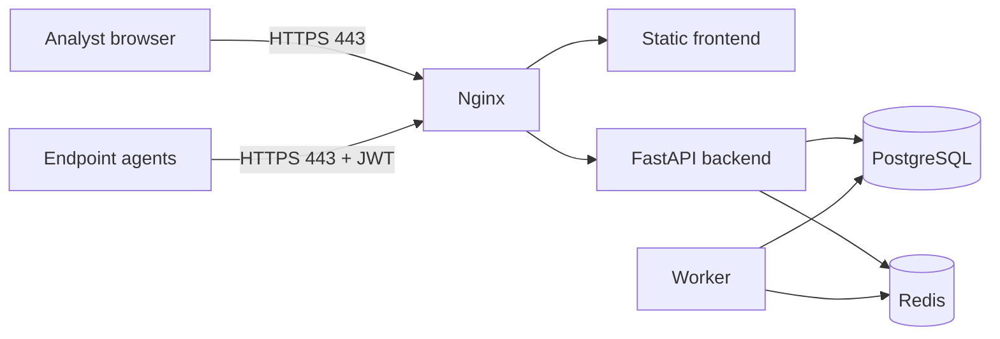
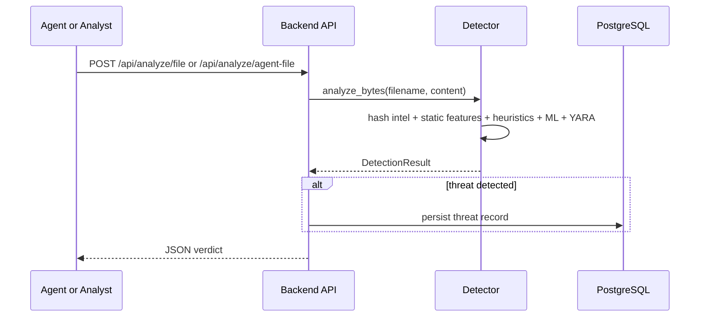

# 02 - Architecture

This document describes the deployable GuardIAn v2 architecture: endpoint
agents, central backend, worker, data stores, frontend SOC console and edge
reverse proxy.

## Components

| Service | Tech | Role | Network |
| --- | --- | --- | --- |
| `backend` | FastAPI, Python 3.12 | REST API, auth, detector orchestration | internal |
| `worker` | Python worker + Redis | Async scans and background jobs | internal |
| `db` | PostgreSQL 16 | Threats, agents, scans, users, audit data | internal |
| `redis` | Redis 7 | Queue, cache, rate-limit support | internal |
| `frontend` | React, Vite, TypeScript, Tailwind | SOC analyst console | edge/internal |
| `nginx` | Nginx | TLS termination and reverse proxy in prod | edge |
| `agent` | Python 3.11+ | Endpoint watcher and telemetry sender | client-side |

## Development topology



Development Compose exposes `5173`, `8000`, `5432` and `6379` locally for
convenience. This is not the production exposure model.

## Production topology



In production, only Nginx should be public. PostgreSQL and Redis remain inside
Docker networks.

## Main data flows

| Flow | Source | Destination | Endpoint / protocol |
| --- | --- | --- | --- |
| Analyst login | Frontend | Backend | `POST /api/auth/login` |
| SOC dashboard | Frontend | Backend | `GET /api/status`, `GET /api/stats` |
| Threat list/actions | Frontend | Backend | `GET /api/threats`, action POST routes |
| File upload analysis | Frontend | Backend | `POST /api/analyze/file` |
| Agent file analysis | Agent | Backend | `POST /api/analyze/agent-file` |
| Network telemetry | Agent / sensor | Backend | `POST /api/network/events` |
| Chat assistant | Frontend | Backend | `POST /api/chat` |

## Detection sequence



## Storage layout

```text
/var/lib/guardian/
|-- uploads/        incoming files for analysis
|-- quarantine/     quarantined samples
|-- models/         trained detector artifacts
`-- rules/          YARA rules
```

These paths are mounted through the `guardian_data` Docker volume, so they
survive backend image updates.

## Authentication model

| Token type | Used by | Lifetime | Notes |
| --- | --- | ---: | --- |
| User JWT | SOC analysts | `JWT_ACCESS_TTL_MINUTES` | login through `/api/auth/login` |
| Agent JWT | Endpoint agents | `JWT_AGENT_TTL_DAYS` | issued during enrollment |

Routes enforce scopes through FastAPI dependencies. Analysts and agents do not
share the same access path.

## Failure modes

| Failure | Expected behaviour |
| --- | --- |
| ML model missing | detector falls back to heuristics/YARA and reports `detector_ready=false` |
| Redis down | worker jobs pause; synchronous API routes can still respond |
| PostgreSQL down | API routes needing persistence fail until DB returns |
| Threat intel keys absent | optional feeds are skipped or run in reduced mode |
| LLM disabled | chat assistant answers from the local knowledge base |
